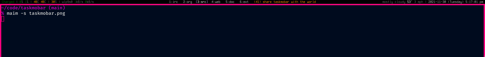

# taskmobar
ridiculously simple script, but it actually wasn't obvious how to go about doing this at first, so I'm sharing for the benefit of others.

simply outputs the active task's id and description for consumption by xmobar (or similar status bar)



if there are multiple active tasks, you get the one with the lowest id number

if there are no active tasks, it will output "No active task"


# usage
copy `taskmobar` script to somewhere in your path like `/usr/local/bin` or `~/.local/bin`

add the following command block to your `xmobarrc`:

`, Run Com "taskmobar" [ ] "task" 30`

then, in your main template you can do something like:

`, template = "%battery% | %multicpu% | %coretemp% | %memory% | %dynnetwork%}%XMonadLog% <fc=#FF8C00> %task% </fc>{%KOMA% | %date% "`

you can see I just added `<fc=#FF8C00> %task% </fc>` for the command to be printed in orange text.

# other useful snippets
in your shell's rc file, you can make taskwarrior commands quicker with something like:
```bash
# start a task
# $1 task id
function start() {
  task $1 start
  clear
  task
}

# stop a task
# $1 task id
function stop() {
  task $1 stop
  clear
  task
}

# complete a task
# $1 task id
function complete() {
  task $1 done
  clear
  task
}
```
you may not want the `clear; task` part, but i like to refresh and see the updated task queue.
